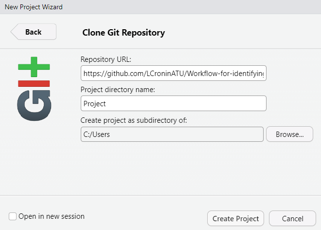

# Workflow-for-identifying-potential-water-quality-events-using-time-series-data

## A full functional water quality project written in R showing a simple step-by-step workflow for processing time series data from a water quality sensor and how to use that data for the identification of potential water quality events.

## Description 

This project contains a concise, reproducible, open-source workflow
detailing the use of R, R markdown and EPA CANARY event detection
software and was designed for catchment scientists, researchers and
those working in on stream hydrochemistry, diffuse pollution or any EU
Water Framework Directive water quality projects who require a simple,
detailed workflow that can be easily replicated requiring minimum
expertise in R. One of the primary objectives of this project was to
provide simple code that non-coders can follow and to produce outputs at
each step of the workflow so the user can validate the code for their
data. This project includes a sample data file and a detailed markdown
so you can take the sample file provided through each step of the
workflow, prior to applying the code to your own data.

Each part of this project is simple sample code which details how to do
the following: \* import time series data, \* clean the data, \*
visualize the data, \* maintain data integrity, \* manually identify
potential water quality events, \* match those events to the output of
EPA CANARY event detection software, \* identify the most suitable
configuration of EPA CANARY for that particular water quality monitoring
station.

## Getting Started

### Dependencies

-   Needs recent install of R and Rstudio.
-   Dependencies are managed through the
    [renv](https://rstudio.github.io/renv/articles/renv.html) package
    which was created by RStudio developers specifically for this
    purpose. The "renv" package will create a package library which is
    specific to this project. Thus you can ensure that you have the
    correct version of all required packages (those used in the original
    build). Outside of the project, you can use or install whatever
    package versions you prefer, those inside the project space will not
    be affected.

### Installing

-   Install R and Rstudio [latest
    versions](https://posit.co/download/rstudio-desktop).

-   Install the "renv" package by typing `install.packages("renv")` in
    the R console.

-   You need to have a [github](https://github.com/) account and a local
    [install of
    git](https://git-scm.com/book/en/v2/Getting-Started-Installing-Git)
    on your machine.

-   Open a git BASH (start the "git BASH app") and [introduce yourself
    to git](https://happygitwithr.com/hello-git). This will allow
    Rstudio to connect successfully to github.

-   Open RStudio and create a New Rstudio Project.

-   Select the option to install from "Version Control".

    

-   Select "git".

-   In the dialog box that follows, fill the first two boxes in as shown
    below:

    

-   In the third box, browse to the folder on your local machine where
    you want to install the project.

-   Select "Create Project"

-   Ensure that "renv" is enabled for the project as follows:

    -   In Rstudio click on "Tools" menu, followed by "Project Options".
    -   Select "Environments" from the list of icons on the left of the
        dialog box.
    -   Ensure the the box beside "Use renv with this project" is ticked
        as shown:
        

-   Now check that the correct versions of all required packages are
    installed by running the command `renv::status()`, from the R
    console. You will see a list of any dependency issues.

-   To resolve any dependency issues, type the command
    `renv::restore()`. The correct version of every required dependent
    package will now install.

-   At this point you should be able to execute any of the scripts or
    RMd documents within any directory.

### Executing program (from Rstudio)

-   Follow the step by step instructions, the code and the output of the
    code in the 'Workflow for Hydrodynamic Event Detection' markdown
    file.
-   The scripts are also available but the markdown file is the place to
    start for users who are new to R.

### Executing program (from Docker)

In the event that you want to run the package from docker, follow the
setup steps described above in order to create a copy of the repository
on your local machine.

Then follow the steps outline [here](Using-docker-guide.md).

### The Workflow
Open the Project file, Project Workflow for detecting Hydrodynamic Water Quality Events (extension R Project) followed by the Workflow-for-Hydrodynamic-Event-Detection ( extension RMD file).  
There is also a Workflow-for-Hydrodynamic-Event-Detection HTML file which can be a helpful read along user guide for those new to R.  It is too large to open in GitHub so must be downloaded to your web browser. 

## Help

[More information on reusing other people's code in your
project](https://docs.github.com/en/get-started/learning-to-code/reusing-other-peoples-code-in-your-projects)

## How to tweak this project for your own use

We would encourage you to clone and rename this project to use for your
own data.

## Find a bug

If you find an issue or would like to submit an inmprovement to this
project please contact me.

## Known issues (work in progress)

This workflow is still ongoing. The streamlining of importing datafiles
has not been completed yet. This is coming soon!

## Authors

[Lisa Cronin](lisa.cronin@atu.ie)

[Cian Taylor](cian.taylor@atu.ie)

## Version History

-   0.1
    -   Initial Release April 2025

## License

This project is licensed under the [MIT] License - see the
LICENSE.md file for details

## Acknowledgments

The authors would like to thank Jonathan Burkhardt, Ph.D.,  Office of Research & Development, U.S. EPA for providing further information on the matching of manually identified events to CANARY events which enabled the development and refinement of the code.
